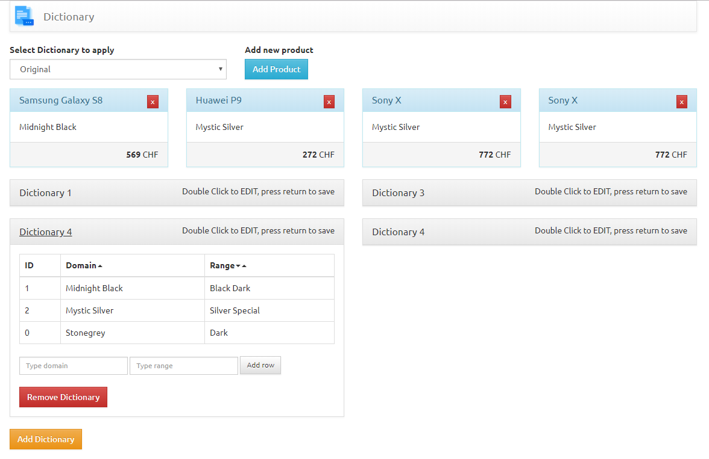
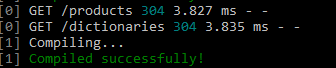
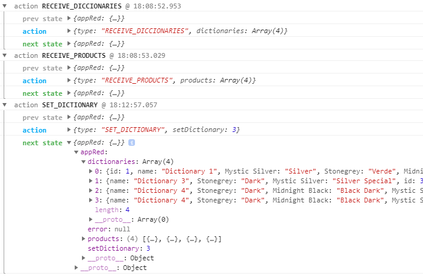
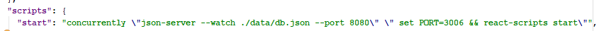
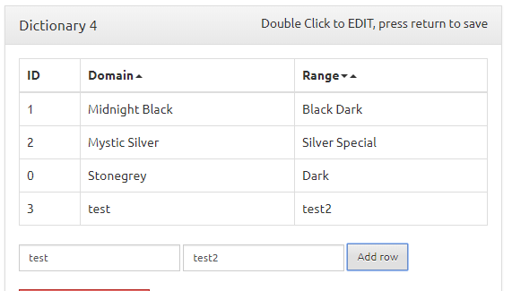
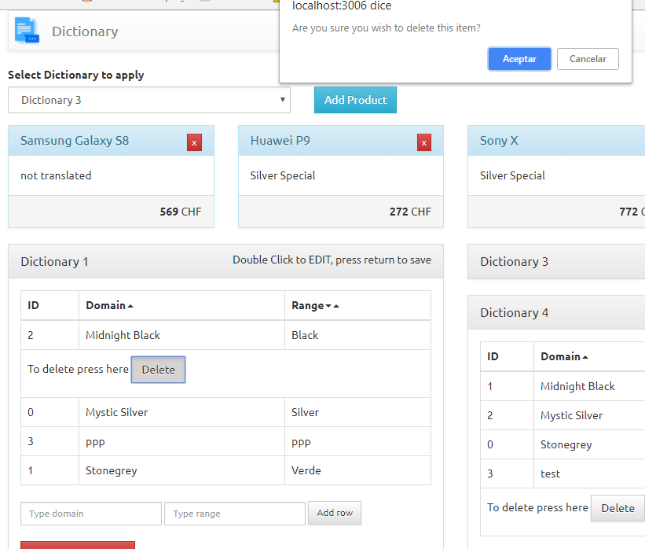
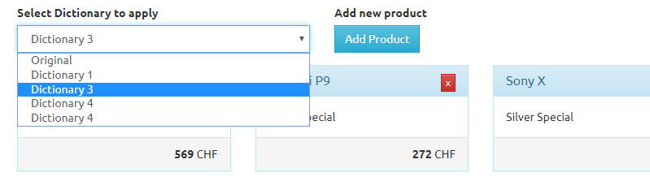
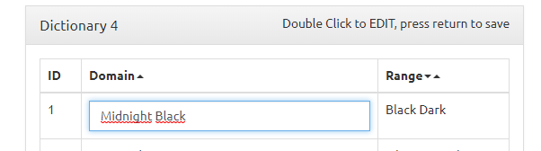
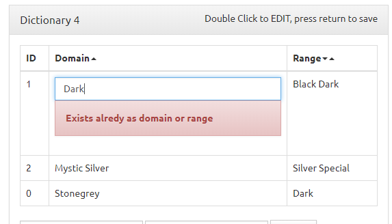
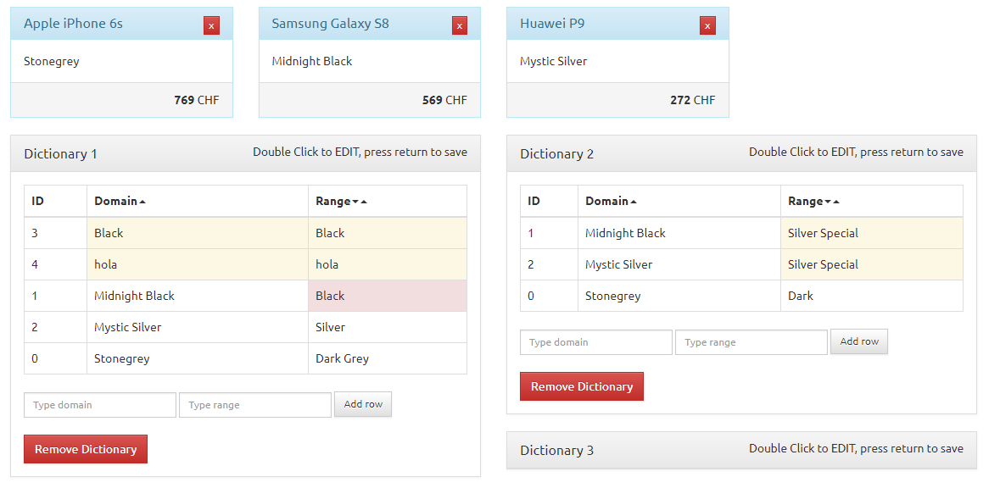

# Dictionaries  

Fetch products and dictionaries from mock server.   
    
- Render products / dictionaries  
- Add new dictionary / product
- Select dictionary to assign and translate. 
- Edit dictionary with some rules (not bucle, not repeated...). 
- Add new word to dictionary
- Remove word from dictionary
- Used Json server to mock api (able to GET, PATCH, PUT, DELETE...) 
- State management with Redux
- Beautify code on git commit7
- Redux state logger on dev
- Proptypes   
  
 Update: Add new value possible without validation, but will add classes _warning_ or _danger_ determining severity.

### Installation

Install the repo and launch it.

```sh
$ git clone https://aalexx1978@bitbucket.org/aalexx1978/dictionary.git 
$ cd dict
$ yarn install
$ yarn start  
```   
   
_on Mac_ to start in other port just run   

```PORT=3001 yarn start```  

  
##  Screenshots
#### Main screen  
  
#### Server json log  
  
#### Redux logger  
 
#### Concurrently for launching json server and app  
  
#### Add word  
  
#### Delete word  
  
#### Selec dictionary to apply  
 
#### Double click to edit  
 
#### Editing a word duplicated 
 
#### Color indicating row added with errors 
 
